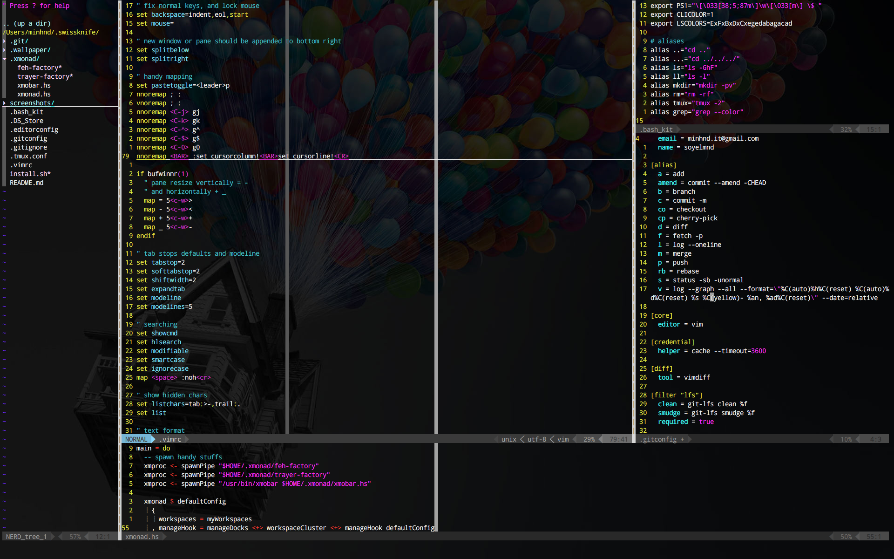

## Quick start

Just as simple as
```'sh'
git clone https://github.com/soyelmnd/.swissknife.git $HOME/.swissknife && $HOME/.swissknife/install.sh
```




More screenshots and detailed guide are to be updated :-) Thanks.
